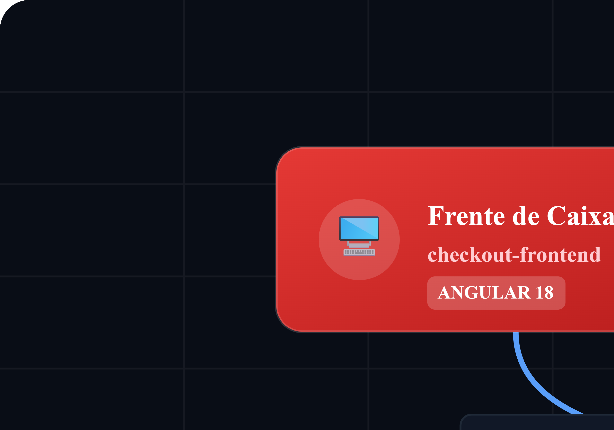
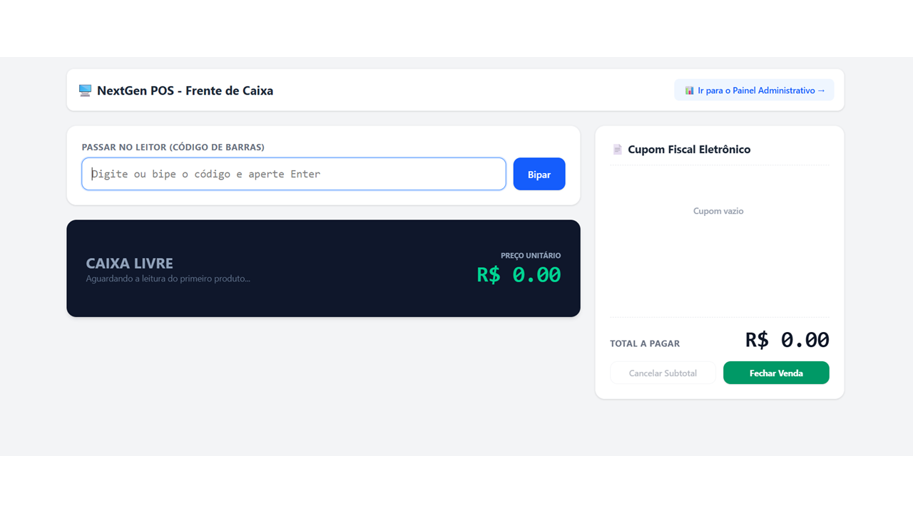
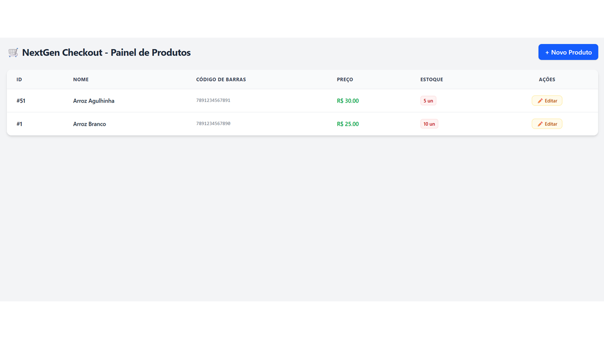

# 🛒 NextGen Checkout - Full-Stack POS System

O **NextGen Checkout** é um ecossistema completo de Ponto de Venda (PDV) e Gestão de Inventário projetado com foco em alta performance, isolamento de responsabilidades e resiliência. O sistema cobre desde a operação física da frente de caixa até o controle administrativo de reabastecimento de produtos na retaguarda.

---

## 🏗️ Arquitetura do Ecossistema e Fluxo de Dados

O projeto foi desenhado seguindo uma abordagem descentralizada e containerizada. Abaixo está o mapeamento de como os componentes se comunicam em tempo real durante a operação de venda e controle de estoque:

<p align="center">
  
</p>

1. **`checkout-frontend` (Angular 18+ & Tailwind CSS v4):** Interface SPA standalone, responsiva e focada na experiência do usuário (UX). Implementa navegação fluida via rotas internas e comunicação assíncrona.
2. **`checkout-backend` (Quarkus + Java 21):** API REST de alto desempenho responsável pelas regras de negócio core. Utiliza transações gerenciadas pelo Hibernate/Panache para garantir a integridade das baixas de estoque.
3. **`infrastructure` (PostgreSQL 16):** Banco de dados relacional robusto configurado com volumes persistentes para isolamento e segurança dos dados transacionais.

---

## 🚀 Principais Funcionalidades Explictadas

### 🖥️ Frente de Caixa (PDV)


* **Leitura de Código de Barras:** Suporte simulado ou físico para bipagem de produtos...

---

### 📊 Painel Administrativo (Retaguarda)


* **Inventário Centralizado:** Listagem completa de produtos...

### 🔄 Fluxo de Resiliência de Estoque (Gargalo de Negócio)
Quando uma venda é disparada com uma quantidade superior ao saldo real no banco de dados, o ecossistema reage de forma resiliente para proteger a operação:

[ Usuário fecha venda ] ➔ [ Quarkus valida estoque ] ➔ [ Saldo Insuficiente! ]
│
[ Tela limpa / Cupom retido ] 🡴 [ Alerta 400 exibido na tela ] 🡴 [ Rollback no Banco ]

* **Garantia de Transação:** A operação é protegida por um contexto `@Transactional`. Se houver falha em qualquer item do carrinho, o banco executa um **Rollback** automático.
* **Feedback ao Operador:** O erro `400 Bad Request` é interceptado pelo Angular, exibindo uma mensagem dinâmica no PDV: `⚠️ Estoque insuficiente para o produto: X (Disponível: Y, Solicitado: Z)`.

---

## 🛠️ Stack Tecnológica

* **Linguagens:** Java 21, TypeScript
* **Framework Backend:** Quarkus (RESTEasy Reactive, Hibernate ORM com Panache)
* **Framework Frontend:** Angular (Components Standalone, RxJS, Router)
* **Estilização:** Tailwind CSS v4
* **Banco de Dados:** PostgreSQL 16
* **Ambiente & Infra:** Docker, Docker Compose, Nginx

---

## 📦 Como Executar o Projeto Localmente

### 1. Clonar o Repositório

```bash
git clone [https://github.com/Vinicius-Infra/nextgen-checkout-system.git](https://github.com/Vinicius-Infra/nextgen-checkout-system.git)
cd nextgen-checkout-system

2. Subir a Infraestrutura e Aplicações

Execute o comando abaixo na raiz do diretório para compilar as imagens e inicializar os containers em segundo plano:

docker compose up -d --build

3. Acessar as Aplicações

Assim que o Docker Compose finalizar a inicialização, as pontas estarão disponíveis nos seguintes endereços:

Frente de Caixa (Frontend): http://localhost:4200

Painel de Controle / Produtos: http://localhost:4200/produtos

API REST (Backend Quarkus): http://localhost:8080